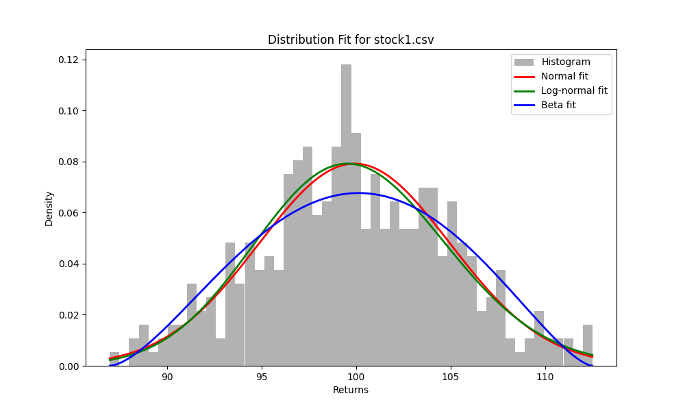
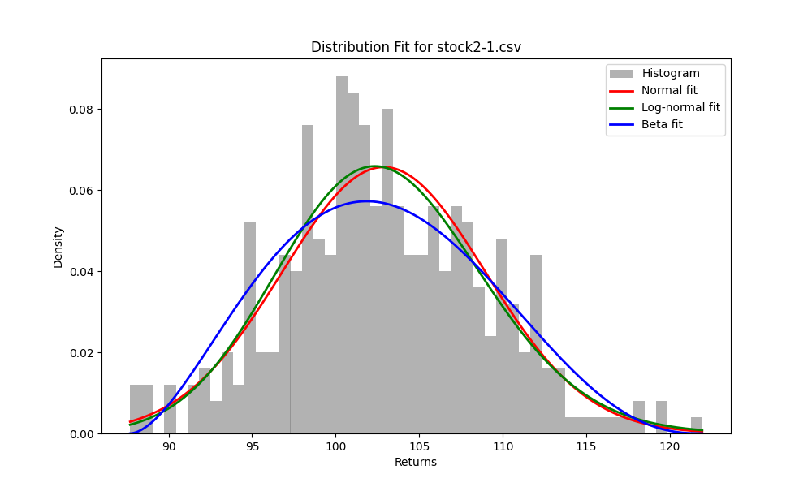

# Homework 3: Options as a Financial Tool

### Group Members
- Brandon Herrin (A02336477)

### Run Instructions
Run `Herrin_Brandon_HW3.py` to generate all plots for Part 1 and calculated option prices for Parts 2 and 3.

## Part 1

### Generated Plots and Kolmogorov-Smirnov Tests

```
K-S test for Normal: stat=0.032171207108126154, p-value=0.8323264146108397
K-S test for Log-normal: stat=0.02492587286250869, p-value=0.9729703143576192
K-S test for Beta: stat=0.0438634006414001, p-value=0.4740017235987818
```


```
K-S test for Normal: stat=0.03594149062806773, p-value=0.7192847965439632
K-S test for Log-normal: stat=0.024799557813071804, p-value=0.9742313417794974
K-S test for Beta: stat=0.05904240014400322, p-value=0.1529055879239295
```

### Best-Fitting Distributions Analysis
We fit normal, log-normal, and beta distributions to the stock's daily returns from both datasets (given in `stock1.csv` and `stock2-1.csv`). To compare the different distributions, the Kolmogorov-Smirnov test and a visualization comparison were used (overlaid histogram with the fitted distributions).

Based upon the visual comparisons and the results of the Kolmogorov-Smirnov test, the log-normal distribution was the best-fitting distribution for both datasets. The visual comparisons showed that both the normal and log-normal distribution fit the datasets better than the beta distribution; however, the Kolmogorov-Smirnov tests were neccessary to establish that the log-normal distribution was better-fit for both datasets. The K-S tests for the log-normal distributions came back with a higher p-value than the normal distributons, indicating a better overall fit.

## Part 2

### Deliverables
1. The Python code for the Monte Carlo simulation is contained in `part2.py`; however, the Monte Carlo simulation can be run independently from the entire assignment by running `python3 part2.py`

2. The computed European option price (using a selected risk-free rate of 0.02) is roughly **$2461**.

## Part 3